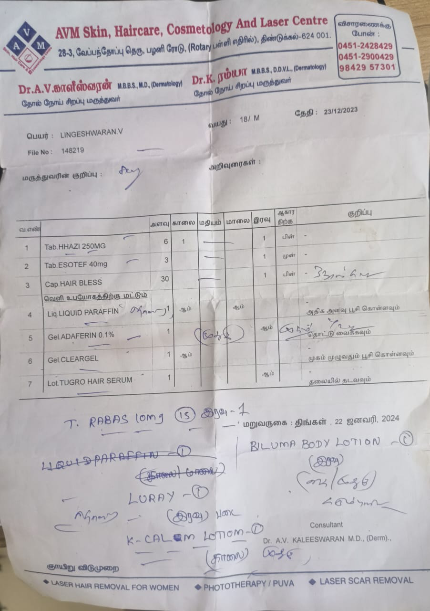
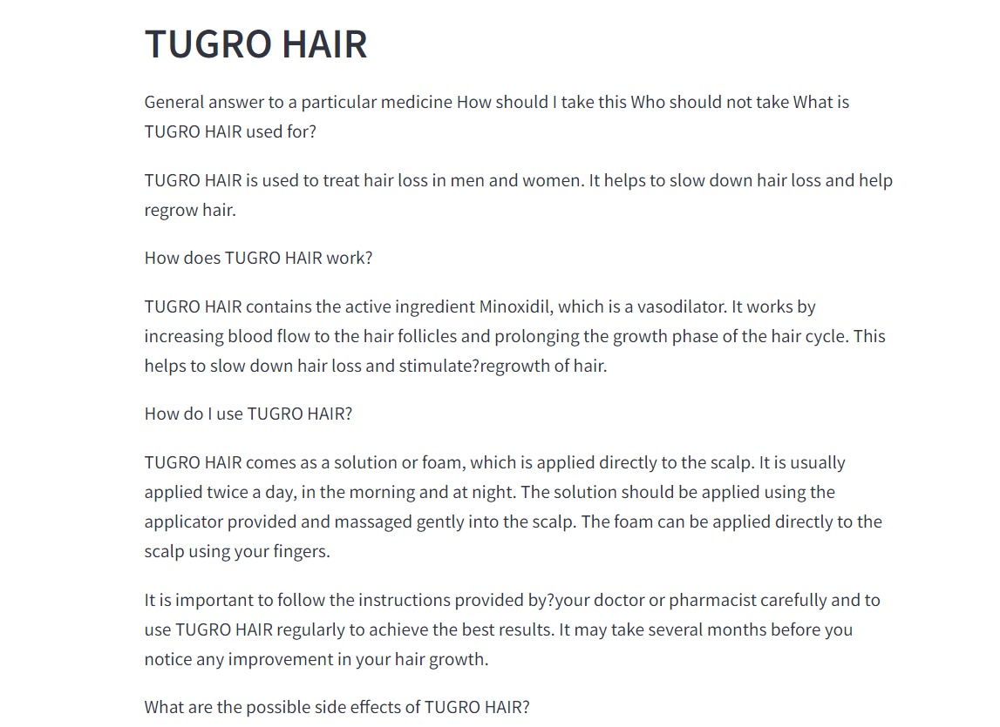
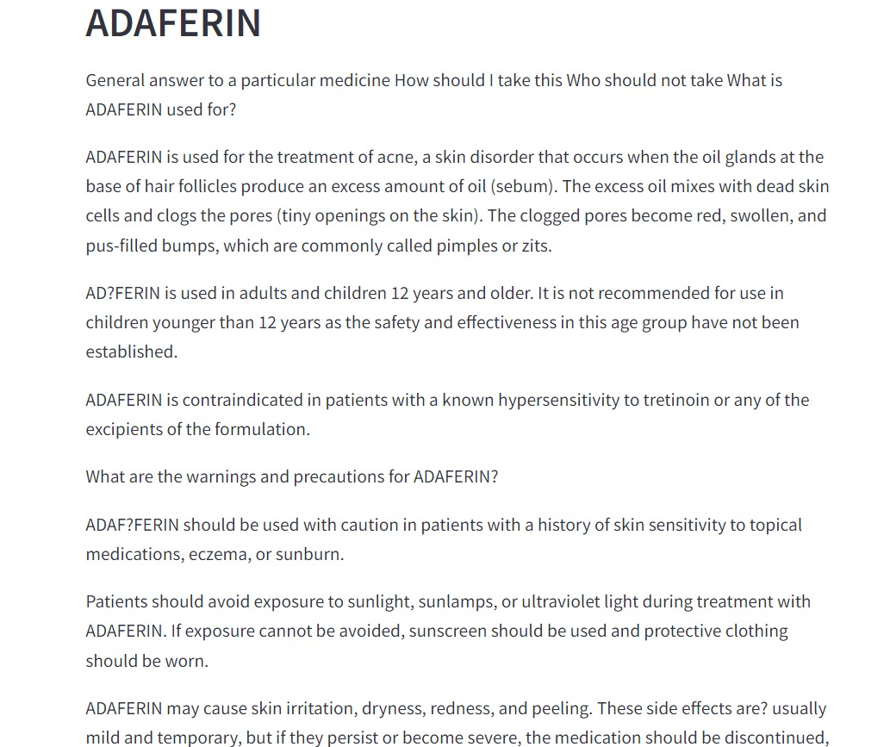
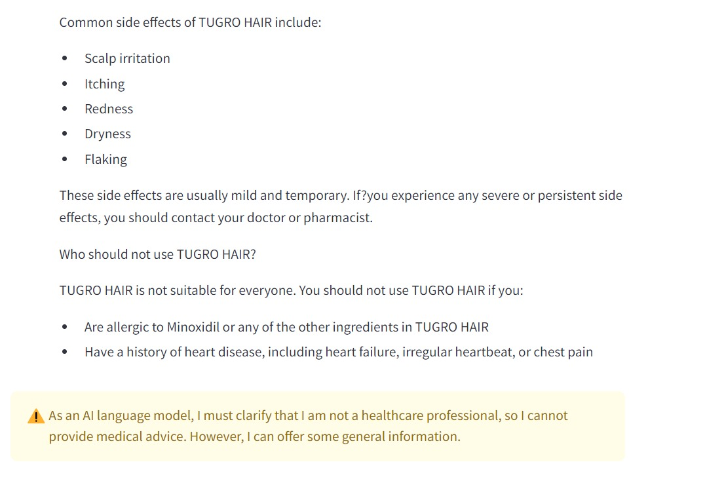
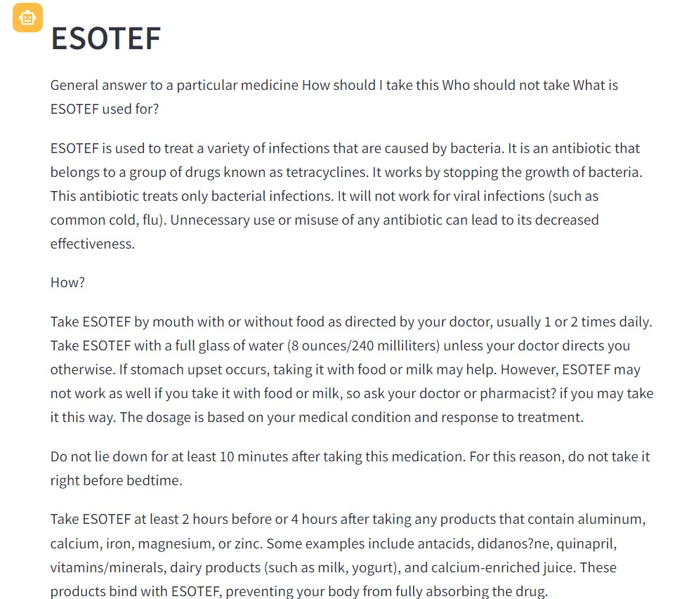
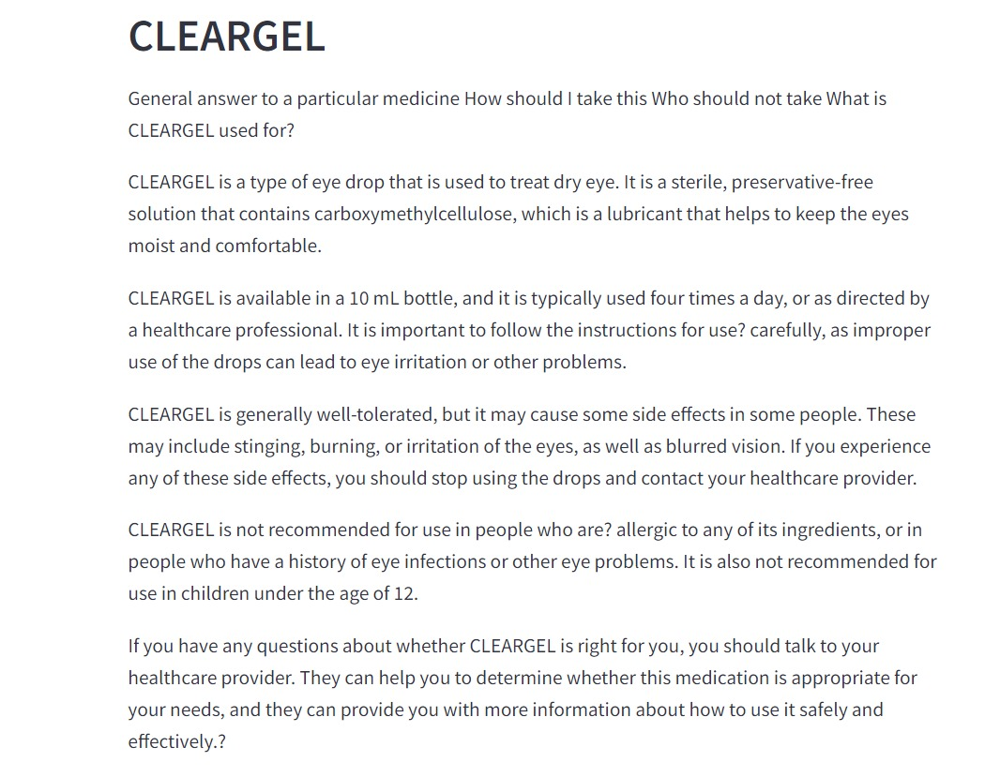
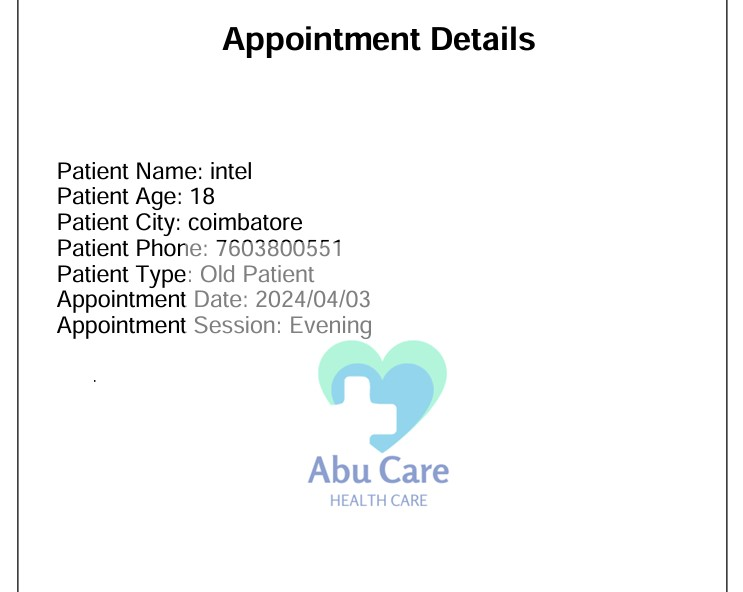
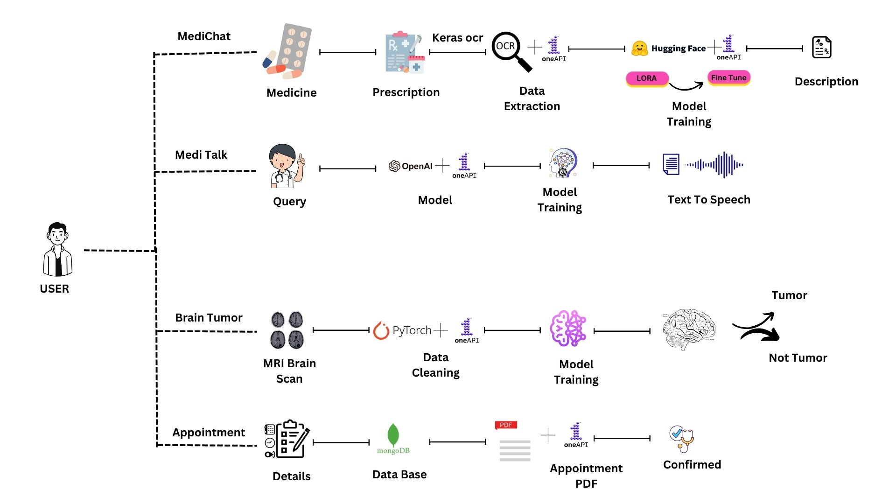

# MediChat-Anokha

# MediChat AI: Transforming Healthcare with AI-Powered Medicine Info, Brain Tumor Prediction, and Appointment Booking! 💊🧠📅
💊🔬 Step into the future of healthcare with **MediChat AI**! 💫
Our revolutionary chatbot transforms your medical experience by providing detailed information about prescribed medicines using cutting-edge OCR technology. With an impressive 93% accuracy rate, we also offer brain tumor predictions, ensuring you have access to vital health insights. Plus, our intuitive appointment booking feature simplifies scheduling doctor visits. Join the healthcare revolution with MediChat AI and experience a new era of seamless medical assistance. 🤖✨

# Demonstration of the Project

https://github.com/ArunKumar200510/MediChat-Anokha/assets/131733014/29268673-cba7-42e2-be4b-49353e5857fe

# MediChat : Three Models🤖 and One Booking🗓️

 1. [Optical-Character-Recognition 📝🔠](#OCR)
 2. [Chat-Bot 💬🤖](#Chat-Bot)
 3. [Brain-Tumor-Prediction 🧠🛡️](#BTP)
 4. [Appointment-Booking 🗓️✅](#appointment)

## Optical-Character-Recognition 📝🔠

This code snippet showcases the utilization of **Intel's scikit and Keras** libraries for Optical Character Recognition (OCR). By efficiently processing images containing text, the system accurately extracts and recognizes characters, enabling the identification of medicines from prescriptions. Leveraging **Intel's CPU or XPU** ensures swift completion, typically in less than a minute, highlighting the advantages of optimized processing capabilities. Notably, running this code in **Google Colab** may exceed 15 minutes due to hardware limitations. ⚙️🔍💊💡
> Input Image

> Output

**Folder Link** : [Click Here](https://github.com/ArunKumar200510/MediChat-Anokha/tree/main/Optical-Character-Recognition)

## Chat-Bot 💬🤖

This code involves configuring a chatbot powered by the **Intel Neural chat 7b-v3-1**, fine-tuned with a specialized dataset. Utilizing transformers and Langchain embeddings, the chatbot provides essential information on medication usage, contraindications, dosage instructions, general properties, and warnings. It encompasses installing dependencies, loading the dataset, configuring the Mistral 7B model for language generation, and setting up Langchain embeddings for semantic understanding. The chatbot's query engine is then initialized to facilitate inquiries about medications, ensuring accurate responses and efficient performance. 🤖💊🔍📋

> Output of Chatbot

**Hugging Face URL** : [Chat-Bot](https://huggingface.co/Intel/neural-chat-7b-v3-1)

**Folder Link** : [Click Here](https://github.com/ArunKumar200510/MediChat-Anokha/tree/main/Chat-Bot)

## Brain-Tumor-Prediction 🧠🛡️

This code snippet illustrates the implementation of a **brain tumor prediction model using PyTorch**, enhanced by Intel's optimizations. Leveraging PyTorch's capabilities alongside Intel's enhancements, the system efficiently processes medical imaging data to predict and classify brain tumors accurately. This integration ensures optimized performance, facilitating swift completion of prediction tasks. Emphasizing the potential of AI in medical diagnostics, the model offers a promising avenue for early detection and intervention. 🧠🔬🔍🚀

**Folder Link** : [Click Here](https://github.com/ArunKumar200510/MediChat-Anokha/tree/main/Brain-Tumor-Prediction)

## Appointment-Booking 🗓️✅

This code snippet showcases an appointment booking system that utilizes **Streamlit** for the user interface and MongoDB for storing appointment data. By leveraging Streamlit's interactive features, users can easily book appointments, while **MongoDB** efficiently handles data storage and retrieval. The system provides a seamless experience for both users and administrators, allowing for streamlined appointment management. 📅💼📊🔒

> Appointment Pdf

# Usage of Intel Developer Cloud 🌐💻

Utilizing the resources provided by Intel Developer Cloud significantly expedited our AI model development and deployment processes. Specifically, we harnessed the power of Intel's CPU and XPU to accelerate two critical components of our project: Human Detection and Text-to-Outfit Generation. 💻⚡

1.  **Optical-Character-Recognition 📝🔠:** The integration of Intel's CPU and XPU capabilities, along with the utilization of oneDNN, has been instrumental in enhancing the efficiency of our Optical Character Recognition (OCR) model. Leveraging the high-performance computing infrastructure provided by Intel, we have significantly reduced the training time required for model optimization and experimentation. By optimizing computational tasks involved in training, oneDNN has contributed to this efficiency, allowing for faster processing of OCR tasks. Notably, a single epoch now takes only 2 seconds, showcasing the remarkable speedup achieved through the use of Intel's hardware resources and optimized software stack. Additionally, the utilization of TensorFlow optimized for Intel architectures has further contributed to reducing the training time, resulting in significant improvements in the efficiency of our OCR model development process and enhancing overall performance. 🚀⚒️🔍

2.  **Chat-Bot 💬🤖  :** Our medicine information retrieval system entails intricate computational processes, especially during data extraction and analysis. Executing these tasks in Google Colab frequently led to extended processing durations due to resource constraints. Nonetheless, harnessing the processing power of Intel Developer Cloud's CPU and XPU resources significantly reduced the processing time. Leveraging Intel's infrastructure's parallel processing capabilities allowed us to swiftly retrieve medicine information, thereby enhancing the overall efficiency of our chatbot system. 💊💻🔍

In essence, Intel Developer Cloud's cutting-edge CPU and XPU technologies equipped us with the computational prowess needed to hasten model training and inference procedures, thereby speeding up our project's development and deployment schedules. 🚀🕒

# Flow Diagram 🔄📊

The workflow diagram visually depicts the sequential steps and interactions within our system. Each phase in the process plays a vital role in the system's functionality, guaranteeing a seamless and effective workflow. Let's explore the core elements:

1.   **Prescription Input 📄🖊️:**

Users upload their prescription documents, which serve as the input for the Optical Character Recognition (OCR) module. The OCR efficiently extracts medicine details from the text, ensuring accurate identification and processing.

2.  **Medication Information Extraction 💊🔍:**

Leveraging the extracted medicine information, the Medication Chatbot provides comprehensive details about each medication, including usage instructions, contraindications, dosage, and general properties, aiding users in understanding their prescribed medications better.

3.  **Brain Scan Upload 🧠📷:**

Users upload MRI or scan images of their brain for tumor prediction. The system employs deep learning models, powered by Intel's optimized Torch, to analyze the images and provide accurate predictions regarding the presence of brain tumors.

4.  **Brain Tumor Prediction 📈🔮:**

Based on the uploaded brain scan images, the system utilizes advanced algorithms to analyze and predict the presence of brain tumors, providing users with critical insights into their health condition.

5.  **Appointment Booking 📅✉️:**

Users can conveniently schedule medical appointments through the system. The Appointment module efficiently manages the booking process, allowing users to select preferred dates and times and generating appointment confirmations in PDF format for easy reference.

# Built With 🛠️

1.  **Frontend - Streamlit:** Our frontend user interface was developed using Streamlit, a powerful Python library for creating web applications with simple Python scripts. Streamlit's intuitive interface allowed us to design interactive and responsive user interfaces effortlessly, streamlining the development process and enhancing user experience. 💻🌐

2.  **Backend - Streamlit:** Streamlit also served as the backend of our application, handling both frontend rendering and server-side logic. With Streamlit's built-in support for data processing and machine learning integration, we were able to implement features such as user authentication, data visualization, and interaction with our machine learning models seamlessly. 🐍🚀

3.  **Machine Learning Models:** Our application leverages machine learning models developed using PyTorch and TensorFlow for various intelligent features. These models are seamlessly integrated into our Streamlit application, providing functionalities such as medication information extraction, brain tumor prediction, and appointment booking with ease. 🤖⚙️

4.  **Other Technologies:** In addition to Streamlit and machine learning models, our application utilizes Langchain for semantic understanding and efficient retrieval of medication information.
              -   **Intel Developer Cloud:** Leveraging Intel's high-performance CPU and XPU capabilities, we accelerated model training and inference processes, reducing processing time and improving overall performance. ⚡💻
              -   **Langchain:** Our application also utilizes Langchain for semantic understanding and efficient retrieval of medication information. By leveraging Langchain's embeddings, we enhance the accuracy and relevance of medication-related responses provided by our chatbot. 💡🔍

# What It Does 🤖🚀
Our application offers a comprehensive and user-friendly platform for individuals seeking medical assistance and information. Here's an overview of its key functionalities:

1.  **Medication Information Retrieval: 📄💊**

  -  Users can upload their prescription documents, initiating the Optical Character Recognition (OCR) process. The OCR efficiently extracts medication details from the text, ensuring accurate identification and processing.
    
2.  **Interactive Medication Chatbot: 💬🧑‍⚕️**

  -  Leveraging the extracted medication information, our Medication Chatbot provides comprehensive details about each medication. This includes usage instructions, contraindications, dosage, general properties, and warnings, aiding users in understanding their prescribed medications better.
    
3.  **Brain Tumor Prediction: 🧠🔍**

  -  Users can upload MRI or scan images of their brain for tumor prediction. Our system employs deep learning models, powered by Intel's optimized Torch, to analyze the images and provide accurate predictions regarding the presence of brain tumors.
    
4.  **Efficient Appointment Booking: 📅✉️**

  -  Our application streamlines the process of scheduling medical appointments. The Appointment Booking module efficiently manages the booking process, allowing users to select preferred dates and times. It also generates appointment confirmations in PDF format for easy reference.
    
In summary, our application combines advanced medical technologies with a streamlined user interface to provide accurate medication information, brain tumor predictions, and convenient appointment booking services. 🌐💊👨‍⚕️

# How We Built It 🛠️👷‍♂️

  -  Developed the frontend using Streamlit for a user-friendly and interactive interface. 💻🔧
  -  Implemented the backend using Python and integrated it with MongoDB for data storage and retrieval. 🐍🚀📦
  -  Utilized Intel's optimized Torch for deep learning-based brain tumor prediction, ensuring accurate and efficient analysis of MRI and scan images. 🧠🔍
  -  Employed Intel's scikit and Keras libraries for Optical Character Recognition (OCR), enabling the extraction of medication information from prescription 
     documents. 📄💊
  -  Integrated Langchain for semantic understanding and efficient retrieval of medication-related information, enhancing the accuracy and relevance of responses 
     provided by our chatbot. 💡🔍

# References For Datasets 📊📚

 - Optical-Character-Recognition : [OCR 🤖📄](https://keras-ocr.readthedocs.io/en/latest/)
 - Chat-Bot : [Kaggle 📄💬](https://www.kaggle.com/datasets/shudhanshusingh/250k-medicines-usage-side-effects-and-substitutes)
 - Brain-Tumor-Identification : [Figshare 🛍️📸](https://figshare.com/articles/dataset/brain_tumor_dataset/1512427)]

# Revolutionizing Healthcare 🏥💻

To revolutionize the healthcare industry, our solution offers a transformative approach to medication management and patient care. By integrating our advanced technologies for medication information extraction, brain tumor prediction, and appointment booking, healthcare providers can streamline their operations, improve patient outcomes, and enhance overall efficiency. Our platform empowers healthcare professionals to deliver personalized medication guidance, accurate brain tumor assessments, and seamless appointment scheduling, ultimately leading to better patient experiences and improved healthcare delivery. With our solution, healthcare organizations can unlock new opportunities for innovation, drive operational excellence, and ultimately, transform the way healthcare is delivered in the modern era. 💊🧠📅🚀
